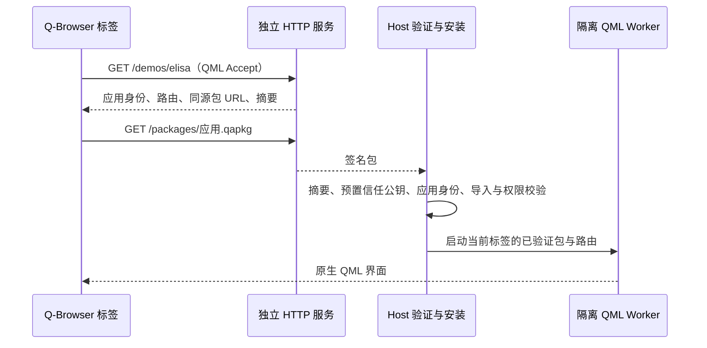

# HTTP QML 网站（协议 v1）

## 工程边界

`sites/qml-demo-site/` 是可独立部署的 Python 服务，负责网站首页、内容协商和发布签名包。它不加载 Qt，也不依赖 Host 的进程、包缓存或私钥。

`apps/host/QmlSiteLoader` 负责 HTTP 客户端协议；`AppRuntimeCoordinator::installSitePackage` 负责安装并保持 Pilot 主包不变。服务并不能直接操纵 Worker。

地址继续显示 HTTP URL，逻辑路由使用 URL 的路径。历史、会话恢复和标签资源监测沿用原有模型。每次进入或重新加载网址均访问服务；首版不提供 HTTP 站点离线缓存回退。

普通浏览器使用同一 URL 获得 HTML 介绍页。QML 在 Q-Browser 的本机 Worker 中运行，这不是 Qt WebAssembly，也不能在普通浏览器中直接播放 QML。

## 首版范围

三个固定入口 `/demos/elisa`、`/demos/tokodon`、`/demos/coffee`，分别绑定原有独立包。用户需以 Pilot 主包启动 package 环境。没有自动授予新应用 ID 或新签名者权限的入口。

新增应用时仍需明确添加本机路由与包允许项，然后单独签名和发布。未来若开放动态站点注册，需要另行定义站点身份、发布者信任和版本回退策略，不能将 HTTP 返回的公钥直接作为信任来源。

协议和独立启动命令见 `sites/qml-demo-site/README.md`。仓库快捷入口为 `scripts/start-qml-site.ps1`。

## 验证

- `tst_browser_address`：HTTP/HTTPS 地址保留、路由解析与非法 URL。
- `tst_qml_site_loader`：同源路径与包身份绑定、真实本机 HTTP 下载、摘要篡改、重定向拒绝和取消回调。
- `tst_app_runtime_coordinator`：安装网站包不替换主包、身份不匹配与损坏包被拒绝。
- `tst_browser_session_store`：现有会话存储完整回归。
- `sites/qml-demo-site/tests`：HTML/JSON 内容协商、包发布、拒绝目录与任意文件访问。

开发部署仍使用开发签名，不产生生产验收证明。
